# Multi-Purpose RAG System Architecture

## Overview

This document outlines the architecture for a flexible RAG (Retrieval-Augmented Generation) platform designed to serve multiple downstream applications while optimizing for different usage patterns and requirements.

### Current Limitations

Our RAG system currently serves a single use case (developer documentation site) with:
- Fixed retrieval parameters
- Standardized prompting strategy
- Single latency vs. accuracy optimization point
- Uniform data source configuration

To serve multiple applications effectively, we need a more flexible architecture.

## Proposed System Architecture: RAG as a Platform

### Core RAG Platform

```
┌──────────────────────────────────────────────────────────────────────┐
│                         RAG Core Platform                            │
├────────────────┬─────────────────┬──────────────────┬────────────────┤
│   Chunk Store  │   Vector Store  │    Embedding     │  LLM Service   │
│   Management   │   Interfaces    │    Pipeline      │   Interface    │
└────────────────┴─────────────────┴──────────────────┴────────────────┘
          ↓               ↓                ↓                 ↓
          └───────────────┼────────────────┼─────────────────┘
                          │                │
                          ↓                ↓
┌────────────────────┐   ┌──────────────────────┐   ┌────────────────────┐
│    Application     │   │      Retrieval       │   │     Response       │
│      Profiles      │   │     Strategies       │   │    Generators      │
└────────────────────┘   └──────────────────────┘   └────────────────────┘
          ↓                        ↓                         ↓
          └────────────────────────┼─────────────────────────┘
                                   │
                                   ↓
                        ┌──────────────────────┐
                        │  Application Adapters│
                        └──────────────────────┘
                                   ↓
    ┌─────────┬─────────┬─────────┬─────────┬─────────┬─────────┐──────────────┐
    │         │         │         │         │         │         │              |
┌──────────┐┌──────────┐┌──────────┐┌──────────┐┌──────────┐┌──────────┐┌──────────────┐
│ Dev Doc  ││ GitHub   ││  API     ││  Aptos   ││ Telegram ││  Slack   ││ Standalone   │
│  Site    ││   Q&A    ││ Service  ││   MCP    ││   Q&A    ││   Q&A    ││ General      │
│Interface ││   Bot    ││  Client  ││  Plugin  ││   Bot    ││   Bot    ││ Purpose Bot  │
└──────────┘└──────────┘└──────────┘└──────────┘└──────────┘└──────────┘└──────────────┘
```

### Alternative Visualization (Mermaid Diagram)

```mermaid
graph TD
    %% Define styles for better readability
    classDef coreComponent fill:#f9d5e5,stroke:#333,stroke-width:2px,color:#333,font-weight:bold,font-size:14px
    classDef serviceLayer fill:#eeeefc,stroke:#333,stroke-width:1px,color:#333,font-weight:bold,font-size:14px
    classDef adapter fill:#d5f5e3,stroke:#333,stroke-width:1px,color:#333,font-weight:bold,font-size:14px
    classDef application fill:#fdebd0,stroke:#333,stroke-width:1px,color:#333,font-weight:bold,font-size:14px
    
    %% Core Platform Layer
    subgraph CorePlatform["RAG Core Platform"]
        direction LR
        ChunkStore["Chunk Store Management"]
        VectorStore["Vector Store Interfaces"]
        Embedding["Embedding Pipeline"]
        LLMService["LLM Service Interface"]
        
        ChunkStore <--> VectorStore
        VectorStore <--> Embedding
        Embedding <--> LLMService
    end
    
    %% Service Layer (instead of Middleware)
    subgraph ServiceLayer["Service Layer"]
        direction LR
        Profiles["Application Profiles"]
        Retrieval["Retrieval Strategies"]
        Response["Response Generators"]
        
        Profiles --> Retrieval
        Retrieval --> Response
        Profiles --> Response
    end
    
    %% Connect Core to Service Layer
    CorePlatform --> ServiceLayer
    
    %% Adapter Layer
    subgraph ApplicationAdapters["Application Adapters"]
        direction LR
        DevDocAdapter["Documentation Site Adapter"]
        GitHubDiscussionsAdapter["GitHub Discussions Adapter"]
        APIAdapter["API Service Adapter"]
        AptosMCPAdapter["Aptos MCP Adapter"]
        TelegramAdapter["Telegram Bot Adapter"]
        SlackAdapter["Slack App Adapter"]
        StandaloneAdapter["Standalone General Purpose Bot Adapter"]
    end
    
    %% Connect Service Layer to Adapters
    ServiceLayer --> ApplicationAdapters
    
    %% Applications Layer
    DocSite["Documentation Site Interface"]
    GitHub["GitHub Discussions Q&A Bot"]
    API["API Service Client"]
    AptosMCP["Aptos MCP Plugin"]
    Telegram["Telegram Q&A Bot"]
    Slack["Slack Q&A Bot"]
    Standalone["Standalone General Purpose Bot"]
    
    %% Connect Adapters to Applications
    DevDocAdapter --> DocSite
    GitHubDiscussionsAdapter --> GitHub
    APIAdapter --> API
    AptosMCPAdapter --> AptosMCP
    TelegramAdapter --> Telegram
    SlackAdapter --> Slack
    StandaloneAdapter --> Standalone
    
    %% Apply styles
    class ChunkStore,VectorStore,Embedding,LLMService coreComponent
    class Profiles,Retrieval,Response serviceLayer
    class DevDocAdapter,GitHubDiscussionsAdapter,APIAdapter,AptosMCPAdapter,TelegramAdapter,SlackAdapter,StandaloneAdapter adapter
    class DocSite,GitHub,API,AptosMCP,Telegram,Slack,Standalone application
    
    %% Add labels for clarity
    CoreLabel["Core Infrastructure"] -.-> CorePlatform
    ServiceLabel["Application Logic & Strategies"] -.-> ServiceLayer
    AdapterLabel["Integration Layer"] -.-> ApplicationAdapters
    AppLabel["Client Applications"] -.-> DocSite
```



## Core Components

### 1. Application Profiles

Application profiles configure how the system behaves for each downstream application:

```json
{
  "profile_id": "github_discussions",
  "description": "GitHub Discussions Integration",
  "retrieval_strategy": {
    "initial_k": 5,
    "follow_up_enabled": true,
    "max_follow_ups": 2,
    "follow_up_threshold": 0.85,
    "reranking_enabled": true,
    "adaptive_k": true,
    "min_k": 3,
    "max_k": 15
  },
  "data_sources": [
    {
      "source_id": "aptos_docs",
      "weight": 1.0,
      "filter": {"doc_type": ["reference", "guide", "tutorial"]}
    },
    {
      "source_id": "github_issues",
      "weight": 0.8,
      "filter": {"status": "closed", "has_solution": true}
    },
    {
      "source_id": "code_examples",
      "weight": 0.9,
      "filter": {"language": "move", "category": ["smart_contract", "transaction"]}
    }
  ],
  "response_generation": {
    "model": "gpt-4-0125-preview",
    "temperature": 0.3,
    "max_tokens": 2048,
    "reasoning_steps": true,
    "citation_style": "markdown_links",
    "use_code_formatting": true
  },
  "performance_targets": {
    "max_latency": 5000,
    "p95_latency": 3000,
    "accuracy_priority": "high",
    "caching_strategy": "aggressive"
  }
}
```

### 2. Retrieval Strategies

The system supports multiple retrieval strategies that can be configured per application:

1. **Speed-Optimized**
   - Single-pass retrieval
   - Smaller embedding models
   - Cached embeddings
   - Fixed small k

2. **Accuracy-Optimized**
   - Multi-step retrieval with follow-ups
   - Hybrid sparse+dense retrieval
   - Re-ranking with cross-encoders
   - Adaptive k based on query complexity

3. **Balanced**
   - Conditional follow-ups based on confidence
   - Tiered retrieval (fast first-pass, deeper second-pass)
   - Smart caching of common queries

### 3. Response Generation Templates

Specialized templates for different application contexts:

1. **Documentation Site**
   - Rich HTML formatting
   - Inline navigation links
   - Expandable code examples
   - "Read more" deep links

2. **GitHub Discussions**
   - Markdown-optimized
   - Code block formatting
   - Reference linking to both docs and other issues
   - Concise problem-focused answers

3. **API Integration**
   - JSON-structured responses
   - Metadata for client rendering
   - Confidence scores
   - Multiple response formats

### 4. Contextual Prompting System

```python
class ContextualPromptManager:
    def __init__(self, profile_id):
        self.profile = load_profile(profile_id)
        self.prompt_templates = load_templates(profile_id)
        
    def generate_system_prompt(self, context_data):
        base_prompt = self.prompt_templates["system_base"]
        
        # Add application-specific instructions
        if self.profile["type"] == "github_discussions":
            base_prompt += self.prompt_templates["github_specific"]
            
            # Add repo-specific context if available
            if "repository" in context_data:
                repo_info = fetch_repo_metadata(context_data["repository"])
                base_prompt += f"\nThis question is about the {repo_info['name']} repository, which is {repo_info['description']}."
        
        # Add response style guidance
        base_prompt += self.prompt_templates["response_style"][self.profile["response_style"]]
        
        return base_prompt
        
    def generate_retrieval_prompt(self, query, retrieved_docs):
        # Select template based on number and quality of retrieved docs
        if len(retrieved_docs) > 10:
            template = self.prompt_templates["synthesis_heavy"]
        elif average_relevance_score(retrieved_docs) < 0.7:
            template = self.prompt_templates["limited_evidence"]
        else:
            template = self.prompt_templates["standard_retrieval"]
            
        # Populate template with docs and query
        return template.format(query=query, documents=format_documents(retrieved_docs))
```

### 5. LLM Service Interface

The system uses a provider-agnostic LLM interface with pluggable implementations:

This interface allows for vastly different implementations depending on provider and use case:

```
┌───────────────────────────────────────────────────────────────┐
│                    LLM Service Interface                       │
└───────────────────────────────────────────────────────────────┘
                 ┌─────────────┴───────────────┐
                 │                             │
┌─────────────────────────────┐   ┌─────────────────────────────┐
│     Simple Implementations   │   │   Complex Implementations   │
├─────────────────────────────┤   ├─────────────────────────────┤
│ • Direct API calls          │   │ • Multi-step reasoning      │
│ • Single-turn completion    │   │ • Self-querying chains      │
│ • Prompt-response pairs     │   │ • Function-calling patterns │
└─────────────────────────────┘   └─────────────────────────────┘
```

```python
class LLMServiceInterface:
    """Interface for all LLM service implementations"""
    
    async def generate_response(self, 
                               prompt: str, 
                               context: dict = None, 
                               parameters: dict = None) -> LLMResponse:
        """Generate a response using the provider's implementation"""
        raise NotImplementedError()
    
    async def generate_with_retrieval(self, 
                                     query: str, 
                                     retrieval_strategy: RetrievalStrategy, 
                                     parameters: dict = None) -> LLMResponse:
        """Generate a response with integrated retrieval capabilities"""
        raise NotImplementedError()
        
    def get_capabilities(self) -> dict:
        """Return the capabilities of this LLM service implementation"""
        raise NotImplementedError()
```

#### Provider-Specific Implementations

Each provider can have custom implementations while maintaining the same interface:

```python
class OpenAICompletionService(LLMServiceInterface):
    """Simple OpenAI completion implementation"""
    
    async def generate_response(self, prompt, context=None, parameters=None):
        # Direct API call implementation
        response = await openai.ChatCompletion.create(
            model=parameters.get("model", "gpt-4"),
            messages=[{"role": "user", "content": prompt}],
            temperature=parameters.get("temperature", 0.7),
            max_tokens=parameters.get("max_tokens", 1000)
        )
        return LLMResponse(content=response.choices[0].message.content)

class FunctionCallingAgentService(LLMServiceInterface):
    """Complex implementation with function-calling capabilities"""
    
    async def generate_response(self, prompt, context=None, parameters=None):
        # Initialize conversation with available functions
        conversation = self._build_initial_conversation(prompt, context)
        functions = self._get_available_functions(parameters)
        
        # Run the agent loop
        return await self._run_agent_loop(conversation, functions, parameters)
    
    async def _run_agent_loop(self, conversation, functions, parameters):
        # Implementation of complex agent-based interaction
        # with function calling, multiple steps, etc.
        pass
```

#### Flow Pattern Configurations

The interface allows applications to define different flow patterns through configuration:

```json
{
  "profile_id": "github_discussions",
  "llm_service": {
    "implementation": "OpenAICompletionService",
    "parameters": {
      "model": "gpt-4-turbo"
    }
  }
}
```

```json
{
  "profile_id": "complex_problem_solver",
  "llm_service": {
    "implementation": "FunctionCallingAgentService",
    "parameters": {
      "model": "gpt-4-turbo",
      "functions": ["retrieve_documents", "search_code", "execute_code"],
      "max_iterations": 5
    }
  }
}
```

#### Integration with Retrieval

The interface can implement different patterns for combining LLM calls with retrieval:

##### Pre-retrieval Pattern

In this pattern, retrieval happens before LLM processing:

```
Query → Retrieval → LLM with context → Response
```

```python
class StandardRAGService(LLMServiceInterface):
    async def generate_with_retrieval(self, query, retrieval_strategy, parameters=None):
        # First retrieve relevant documents
        documents = await self.retriever.retrieve(query, retrieval_strategy)
        
        # Then format documents into context
        formatted_context = self._format_documents(documents)
        
        # Build prompt with context
        prompt = self._build_prompt_with_context(query, formatted_context)
        
        # Call LLM with prepared prompt
        return await self.generate_response(prompt, parameters=parameters)
```

##### LLM-in-control Pattern

In this pattern, the LLM decides when and what to retrieve:

```
Query → LLM → (Decision to retrieve) → Retrieval → LLM with new context → Response
```

```python
class LLMControlledRetrievalService(LLMServiceInterface):
    async def generate_with_retrieval(self, query, retrieval_strategy, parameters=None):
        # Initialize conversation
        conversation = [{"role": "user", "content": query}]
        
        # Define retrieval function
        async def retrieve_documents(query, k=5):
            documents = await self.retriever.retrieve(query, k=k)
            return self._format_documents(documents)
        
        # Make retrieval function available to LLM
        functions = [
            {
                "name": "retrieve_documents",
                "description": "Retrieve relevant documents for a query",
                "parameters": {
                    "type": "object",
                    "properties": {
                        "query": {"type": "string"},
                        "k": {"type": "integer", "default": 5}
                    },
                    "required": ["query"]
                }
            }
        ]
        
        # Let LLM control the retrieval process
        return await self._run_llm_controlled_process(conversation, functions, parameters)
```

#### Factory Pattern for Service Creation

Application profiles use a factory to create appropriate LLM service implementations:

```python
class LLMServiceFactory:
    @staticmethod
    def create_service(profile):
        """Create LLM service based on application profile"""
        service_config = profile.get_llm_service_config()
        
        if service_config.implementation == "OpenAICompletionService":
            return OpenAICompletionService(**service_config.parameters)
        elif service_config.implementation == "FunctionCallingAgentService":
            return FunctionCallingAgentService(**service_config.parameters)
        elif service_config.implementation == "AnthropicService":
            return AnthropicService(**service_config.parameters)
        elif service_config.implementation == "AzureOpenAIService":
            return AzureOpenAIService(**service_config.parameters)
        elif service_config.implementation == "CustomModelService":
            return CustomModelService(**service_config.parameters)
        # ...other implementations
        else:
            raise ValueError(f"Unknown LLM service: {service_config.implementation}")
```

#### Common Implementation Patterns

The system includes several standard implementation patterns:

##### Single-Call Pattern
For simpler use cases where one LLM call with context is sufficient:

```python
result = await llm_service.generate_response(
    prompt=format_prompt(query, context),
    parameters={"temperature": 0.2}
)
```

##### Multi-Step Reasoning Pattern
For complex problems requiring step-by-step thinking:

```python
# Configure chain-of-thought pattern
parameters = {
    "reasoning_strategy": "chain_of_thought",
    "prefix": "Let's think through this step by step:",
    "temperature": 0.2
}

result = await llm_service.generate_response(
    prompt=query,
    parameters=parameters
)
```

##### Self-Query Refinement Pattern
For cases where the LLM should refine its own retrieval:

```python
# Initial query
initial_result = await llm_service.generate_with_retrieval(
    query=user_query,
    retrieval_strategy=RetrievalStrategy(k=3)
)

# Let LLM generate follow-up queries
follow_up_queries = await llm_service.generate_response(
    prompt=f"Based on the initial information about '{user_query}', what follow-up questions should we ask to get more specific information?",
    context={"initial_result": initial_result},
    parameters={"format": "json", "temperature": 0.2}
)

# Process follow-up queries and combine results
# ...
```

### 6. Adaptive Execution Engine

A runtime that adapts retrieval and response strategies based on real-time signals:

1. **Query Classification**
   - Identify query type (how-to, concept, error, etc.)
   - Adjust retrieval parameters accordingly
   - Select appropriate LLM for the task

2. **Latency Management**
   - Monitor execution time at each step
   - Skip optional steps when approaching latency threshold
   - Degrade gracefully (return partial results when needed)

3. **Cost Management**
   - Track token usage and operation costs
   - Apply different strategies based on usage patterns
   - Implement tiered service levels

```python
def adaptive_rag_pipeline(query, profile_id, context=None):
    # Load application profile
    profile = load_profile(profile_id)
    
    # Classify query to adjust strategy
    query_type = classify_query(query)
    
    # Initialize strategy with profile settings
    strategy = RetrievalStrategy.from_profile(profile, query_type)
    
    # Start tracking execution metrics
    metrics = ExecutionMetrics()
    
    # Phase 1: Initial retrieval
    with metrics.track("initial_retrieval"):
        initial_results = run_retrieval(query, strategy.initial_k, profile.data_sources)
    
    # Check if we're approaching latency limits
    if metrics.current_latency > profile.performance_targets.warning_threshold:
        # Skip enhancements if we're running long
        strategy.disable_enhancements()
    
    # Phase 2: Conditional follow-ups
    enhanced_results = initial_results
    if strategy.follow_up_enabled and confidence_below_threshold(initial_results):
        with metrics.track("follow_up_retrieval"):
            enhanced_results = run_follow_up_queries(query, initial_results, strategy)
    
    # Phase 3: Generate response with appropriate template and model
    with metrics.track("response_generation"):
        response_generator = ResponseGenerator.from_profile(profile, query_type)
        response = response_generator.generate(query, enhanced_results, context)
    
    # Record execution metrics for optimization
    record_execution(profile_id, query, metrics)
    
    return response, metrics
```

## Repository Structure

```
/aptos-dev-intensified/         # Root of the repository
├── app/                        # Current application code
│
├── rag_platform/               # New modular RAG platform
│   ├── core/                   # Core RAG engine components
│   │   ├── chunk_store/        # Chunk storage management
│   │   │   ├── __init__.py
│   │   │   ├── interfaces.py   # Abstract interfaces 
│   │   │   ├── firestore.py    # Firestore implementation
│   │   │   └── local.py        # Local storage implementation
│   │   │
│   │   ├── vector_store/       # Vector database interfaces
│   │   │   ├── __init__.py
│   │   │   ├── interfaces.py   # Abstract interfaces
│   │   │   ├── faiss.py        # FAISS implementation
│   │   │   └── query.py        # Vector query operations
│   │   │
│   │   ├── embedding/          # Embedding pipeline
│   │   │   ├── __init__.py
│   │   │   ├── interfaces.py   # Abstract interfaces
│   │   │   ├── openai.py       # OpenAI embeddings
│   │   │   ├── cache.py        # Embedding caching
│   │   │   └── batch.py        # Batch embedding operations
│   │   │
│   │   └── llm/                # LLM service interfaces
│   │       ├── __init__.py
│   │       ├── interfaces.py   # LLMServiceInterface definition
│   │       ├── openai.py       # OpenAI implementation
│   │       ├── anthropic.py    # Claude implementation
│   │       └── custom.py       # Custom model implementation
│   │
│   ├── processors/             # Content processing/strategies components
│   │   ├── retrieval/          # Retrieval methods and algorithms
│   │   │   ├── __init__.py
│   │   │   ├── standard.py     # Standard retrieval
│   │   │   ├── adaptive.py     # Adaptive retrieval (from existing)
│   │   │   └── graph_based.py  # Graph-based retrieval
│   │   │
│   │   ├── chunking/           # Chunking algorithms and utilities
│   │   │   ├── __init__.py
│   │   │   ├── base.py         # Base chunking interfaces
│   │   │   ├── sliding.py      # Sliding window chunking
│   │   │   ├── recursive.py    # Recursive text splitting
│   │   │   └── token_aware.py  # Token-count aware chunking
│   │   │
│   │   └── formatting/         # Response formatting logic
│   │       ├── __init__.py
│   │       ├── markdown.py     # Markdown formatting
│   │       ├── html.py         # HTML formatting
│   │       └── json.py         # JSON response formatting
│   │
│   ├── data_sources/           # Data source integrations with source-specific chunking
│   │   ├── __init__.py
│   │   ├── base.py             # Common data source interface
│   │   │
│   │   ├── aptos_docs/         # Aptos documentation
│   │   │   ├── __init__.py
│   │   │   ├── ingestion.py    # Document ingestion pipeline
│   │   │   ├── schema.py       # Documentation schema
│   │   │   └── chunking.py     # Documentation-specific chunking strategy
│   │   │
│   │   ├── github_repos/       # GitHub repositories
│   │   │   ├── __init__.py
│   │   │   ├── ingestion.py    # Code and issue ingestion
│   │   │   ├── indexing.py     # Repository indexing
│   │   │   ├── code_chunking.py # Code-specific chunking strategy
│   │   │   └── issue_chunking.py # Issue and PR chunking strategy
│   │   │
│   │   ├── slack/              # Slack messages
│   │   │   ├── __init__.py
│   │   │   ├── ingestion.py    # Message ingestion
│   │   │   ├── scheduler.py    # Daily sync scheduler
│   │   │   └── chunking.py     # Conversation-aware chunking strategy
│   │   │
│   │   └── notion/            # Notion documents
│   │       ├── __init__.py
│   │       ├── ingestion.py    # Page/database ingestion
│   │       ├── api_client.py   # Notion API client
│   │       └── chunking.py     # Notion-specific chunking strategy
│   │
│   ├── profiles/               # Application profile management
│   │   ├── __init__.py
│   │   ├── schema.py           # Profile schema definitions
│   │   ├── manager.py          # Profile loading and storage
│   │   └── defaults/           # Default profiles
│   │       ├── dev_docs.json   # Documentation site profile
│   │       ├── github.json     # GitHub discussions profile
│   │       └── api.json        # API service profile
│   │
│   └── adapters/               # Application adapters
│       ├── __init__.py
│       ├── base.py             # Base adapter interface
│       ├── dev_docs.py         # Documentation site adapter
│       ├── github_bot.py       # GitHub bot adapter
│       ├── api_service.py      # API service adapter
│       ├── aptos_mcp.py        # Aptos MCP adapter
│       ├── telegram_bot.py     # Telegram bot adapter
│       ├── slack_app.py        # Slack app adapter
│       └── standalone_bot.py   # Standalone bot adapter
│
├── applications/               # Actual application implementations
│   ├── dev_docs/               # Documentation site
│   │   ├── __init__.py
│   │   └── main.py             # Entry point
│   │
│   ├── github_bot/             # GitHub bot application
│   │   ├── __init__.py
│   │   └── main.py             # Entry point
│   │
│   ├── api_service/            # API service application
│   │   ├── __init__.py
│   │   └── main.py             # Entry point
│   │
│   └── standalone_bot/         # Standalone chatbot application
│       ├── __init__.py
│       └── main.py             # Entry point
│
├── tests/                      # Test suite
│   ├── unit/                   # Unit tests
│   ├── integration/            # Integration tests
│   └── e2e/                    # End-to-end tests
│
└── config/                     # Configuration files
    ├── dev.json                # Development config
    ├── test.json               # Testing config
    └── prod.json               # Production config
```

### Relationship Between Data Sources and Chunking

The relationship between data sources and chunking works as follows:

1. **processors/chunking/** contains general-purpose chunking algorithms:
   - Basic chunking algorithms (sliding window, recursive, token-aware)
   - Common utilities for text processing
   - Interface definitions for chunking strategies

2. **data_sources/[source]/chunking.py** contains source-specific chunking implementations:
   - Each data source defines its own chunking strategy tailored to its content type
   - These implementations can use the general algorithms from processors/chunking as building blocks
   - Source-specific chunking handles unique aspects of that content type:
     - Code files may need language-aware chunking that preserves functions
     - Documentation may need header-based chunking that preserves hierarchical structure
     - Conversations may need thread-aware chunking that preserves dialogue context

3. **Chunking flow example** for GitHub repositories:
   ```
   1. data_sources/github_repos/ingestion.py fetches raw content from repos
   2. data_sources/github_repos/code_chunking.py processes code files:
      - Identifies programming language
      - Uses processors/chunking/token_aware.py for token counting
      - Applies language-specific chunking rules (preserving functions, etc.)
   3. Chunks are then stored in chunk_store and embedded via embedding pipeline
   ```

4. **Multiple chunking strategies per source**:
   - GitHub repos can have separate chunking for code vs. issues
   - Aptos docs might have different chunking for API reference vs. tutorials
   - Each strategy is tailored to the specific content characteristics

## Implementation Strategy

### Phase 1: Core Platform Refactoring

1. **Extract Core Components**
   - Isolate chunk store, vector store, embedding, and LLM services
   - Define clean interfaces between components
   - Implement configuration system for each component

2. **Create Profile System**
   - Design profile schema
   - Implement profile loading and validation
   - Create baseline profiles for current applications

3. **Metrics and Telemetry**
   - Add comprehensive timing and usage metrics
   - Implement performance monitoring
   - Create dashboard for system visibility

### Phase 2: Application-Specific Adaptations

1. **GitHub Discussions Integration**
   - Create GitHub-specific retrieval strategy
   - Implement Markdown-optimized response formatting
   - Build context enrichment from repository metadata

2. **API Service Layer**
   - Design and implement API contracts
   - Add authentication and rate limiting
   - Create client SDKs for common languages

3. **Context Injection Framework**
   - Allow downstream applications to inject context
   - Implement context preprocessing
   - Create context-aware prompt generation

### Phase 3: Dynamic Optimization

1. **Query Classification System**
   - Train classifier for query types
   - Implement dynamic parameter selection
   - Add feedback loop for improvement

2. **Adaptive Execution**
   - Implement time-budgeted execution
   - Add dynamic strategy adjustment
   - Create graceful degradation paths

3. **Continuous Learning**
   - Build feedback collection from all applications
   - Implement automatic profile optimization
   - Create A/B testing framework for strategies

## Application-Specific Implementations

### GitHub Discussions

1. **Integration Patterns**
   - GitHub App/Action triggered on new discussions
   - Async response posting with edit support
   - User feedback collection via reactions

2. **Special Requirements**
   - Repository-specific knowledge prioritization
   - Code-focused responses
   - Shorter response times
   - Handling of code-heavy questions

Example Configuration:

```json
{
  "profile_id": "github_discussions_aptos",
  "description": "GitHub Discussions Integration for Aptos Repositories",
  "retrieval_strategy": {
    "initial_k": 8,
    "follow_up_enabled": true,
    "max_follow_ups": 1,
    "prioritize_code": true,
    "repository_boost_factor": 1.5
  },
  "data_sources": [
    {
      "source_id": "aptos_docs",
      "weight": 1.0
    },
    {
      "source_id": "github_issues_aptos",
      "weight": 1.2,
      "recency_boost": true,
      "max_age_days": 180
    },
    {
      "source_id": "aptos_code_examples",
      "weight": 1.3
    },
    {
      "source_id": "current_repository",
      "weight": 1.5,
      "dynamic": true
    }
  ],
  "response_generation": {
    "model": "gpt-4-turbo",
    "format": "github_markdown",
    "max_length": 1500,
    "code_block_style": true,
    "include_sources": true
  },
  "performance_targets": {
    "max_latency": 8000,
    "accuracy_priority": "high"
  }
}
```

### API Service

1. **Interface Design**
   - Synchronous and asynchronous endpoints
   - Structured JSON responses
   - Parameter customization
   - Batch processing support

2. **Customization Options**
   - Selectable response formats
   - Control over retrieval depth
   - Confidence thresholds
   - Citation options

## Performance Optimization

### Caching Strategy

Implement multi-level caching to balance performance and freshness:

1. **Query Result Caching**
   - Cache frequent queries with configurable TTL
   - Application-specific cache policies
   - Invalidation hooks for content updates

2. **Embedding Caching**
   - Cache embeddings for common queries
   - Share embedding cache across applications
   - Versioned cache for model updates

3. **Document Chunk Caching**
   - Cache retrieved chunks
   - Update on document changes
   - LRU eviction with size limits

### Graph-Based Retrieval

Implement graph-based retrieval to enhance the quality of results:

1. **Structural Relationships**
   - Parent-child document relationships
   - Section hierarchies within documents

2. **Semantic Relationships**
   - Related concepts and topics
   - Similar code examples or patterns

3. **Sequential Relationships**
   - Previous/next steps in tutorials
   - Prerequisite concepts

4. **Referential Relationships**
   - Cross-references between documents
   - Function calls and dependencies in code

## Evaluation Framework

1. **Shared Test Suite**
   - Core retrieval quality benchmarks
   - Response accuracy metrics
   - Performance and latency tests

2. **Application-Specific Tests**
   - GitHub response format validation
   - API contract compliance
   - Documentation site rendering tests

3. **Continuous Evaluation**
   - Automated nightly benchmarks
   - Regression detection
   - Performance trend analysis

## Migration Strategy

To migrate from the current implementation to this architecture:

1. **Refactor Core Components**
   - Move relevant code from `utils/topic_chunks.py` to appropriate modules in `chunk_store/` and `vector_store/`
   - Move code from `utils/vector_store_utils.py` to `vector_store/query.py` and `embedding/` modules
   - Move adaptive retrieval logic from `utils/adaptive_retrieval.py` to `processors/retrieval/adaptive.py`

2. **Extract General Chunking Algorithms**
   - Identify common chunking patterns in the current code
   - Move them to `processors/chunking/` as reusable algorithms
   - Create appropriate interfaces in `processors/chunking/base.py`

3. **Implement Source-Specific Chunking**
   - Create data source modules with their own chunking implementations
   - Each implementation should use the general algorithms as building blocks
   - Add source-specific optimizations for each content type

4. **Implement Application Profiles**
   - Create the profile schema based on current configuration patterns
   - Define default profiles matching current behavior
   - Add profile loading and management logic

5. **Build Adapters Incrementally**
   - Start with documentation site adapter since it's the current use case
   - Add one adapter at a time with thorough testing
   - Ensure backward compatibility throughout

## Conclusion

By refactoring our RAG system into a platform with modular components and application-specific profiles, we can efficiently serve multiple downstream applications while maintaining high quality. Key success factors include:

1. Clear separation of concerns between core RAG functionality and application-specific adaptations
2. Flexible configuration system through profiles
3. Dynamic adjustment based on query characteristics and runtime metrics
4. Application-specific prompt engineering and response formatting
5. Comprehensive monitoring and continuous improvement

This architecture provides a scalable foundation for extending our RAG capabilities to new use cases without duplicating core functionality, while allowing each application to benefit from improvements to the shared platform. 